# Getting data in your projects.

## From the Cloud Object Storage connection
Presuming you have access to a Cloud Object Storage (COS) on **IBM Cloud**, you can add a connection to the COS within your project and retrieve data assets from the COS folder.

### Create a connection to the Cloud Object Storage
1. From the **IBM Cloud** resource list, extend the storage area.
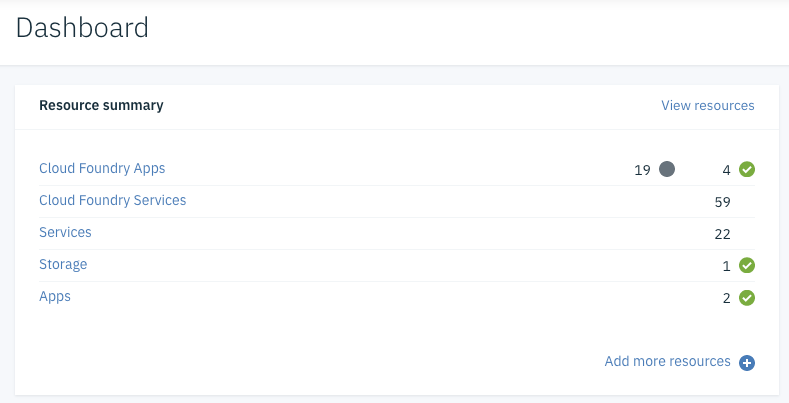
> On lite accounts, there can only be one instance of the Cloud Object Storage service.   

2. Open the appropriate Cloud Object Storage service, and create a bucket. 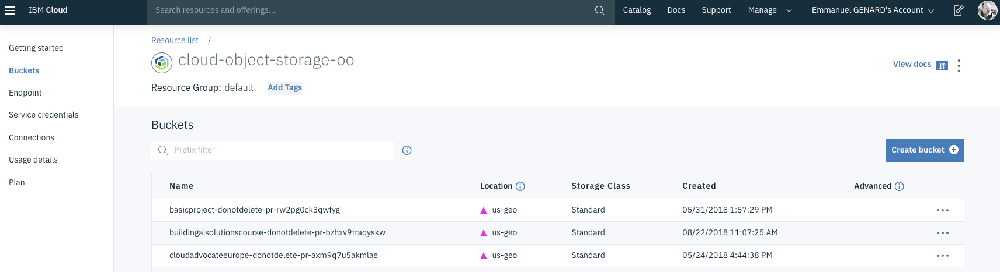  
3. Give the bucket a name, select **Cross Region** for the _Resiliency_ and the appropriate _Location_. Leave the other options as default and click **Create Bucket**.
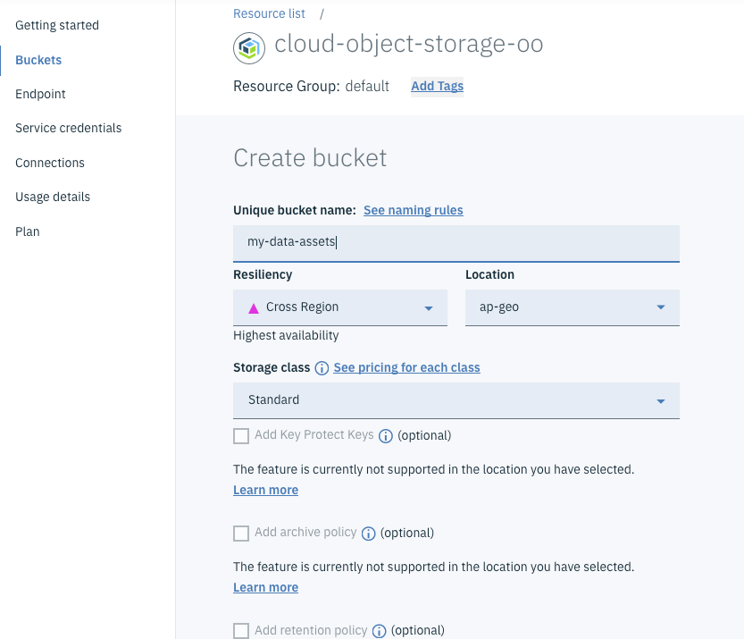
4. Upon bucket creation, you can upload assets to the bucket by dragging and dropping objects to it or directly by uploading a folder. Upload can benefit from **Aspera Connect** file transfer, which is fast and secure. In this case upload an entire folder.
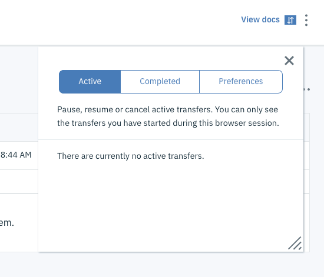
> Repeat this operation to upload all the needed files and/or folders in Cloud Object Storage.  The next step will establish a connection to the COS.

5. Navigate to the buckets **Configuration** and make note of the **Cloud Resource Name** (CRN) and the Endpoints available to access your COS and the Bucket.  
**Endpoint:** `s3.private.dal.us.cloud-object-storage.appdomain.cloud`
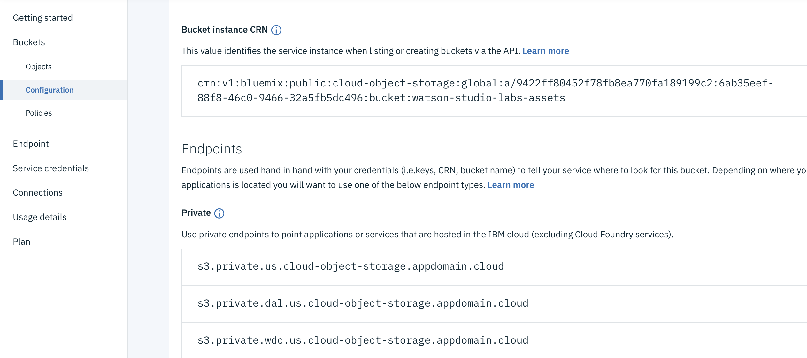

6. Navigate to the **Service Credentials** of your COS. Create **New Credential**. Create a **Service ID** and **DO NOT ACCEPT THE AUTO-GENERATED name**.
>Provide a meaningful name, you will need it in the next part.
Note the credentials (access key, secret access key, API key, instance ID and endpoint) which should be needed to define the connection in **IBM Watson Studio**.
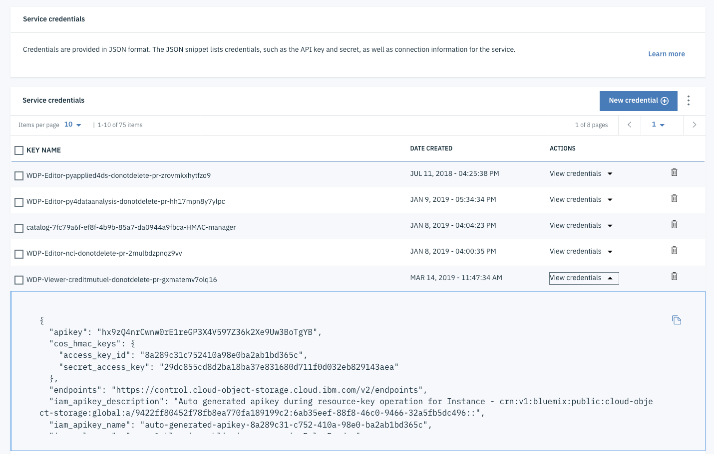  

8. Navigate back in your bucket **Policies** section. On the **Service IDs** create an **Access Policy** selecting the service ID you have created in previous step. Keep the default `Writer` role. Click on **Create access policy**
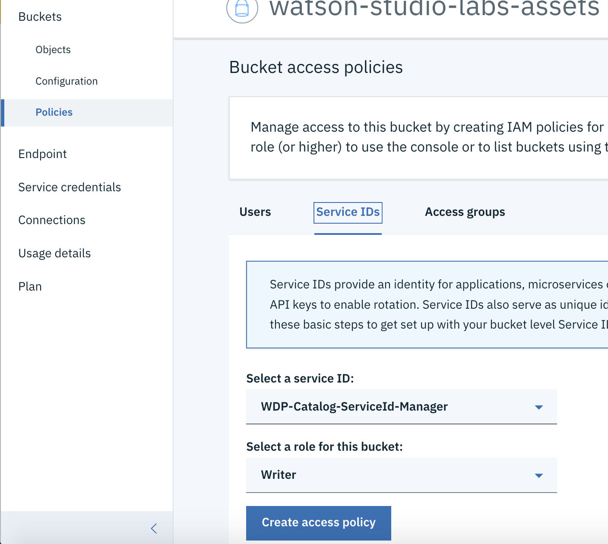

6. From **IBM Watson Studio**, create a project and give it a name or use an already existing project.

7. From the **Assets** tab, click **Add to Project** and select **Connection**.
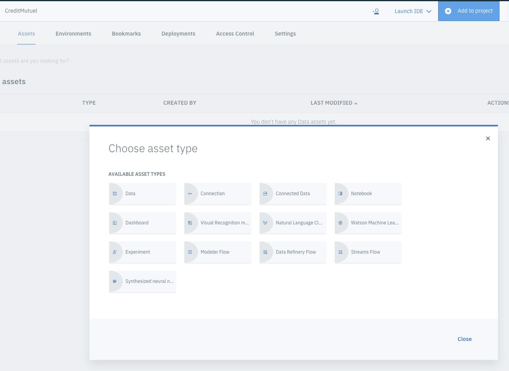

8. From the **New Connection**, in the **IBM Services**, click **Cloud Object Storage** and fill in the connection details with the credentials info collected from the COS service credentials.
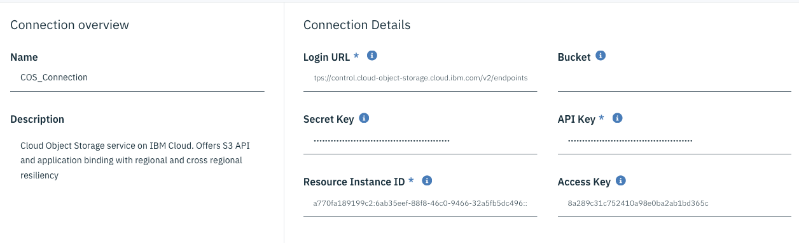

9. The connection will be added to your project in the **Data Assets**
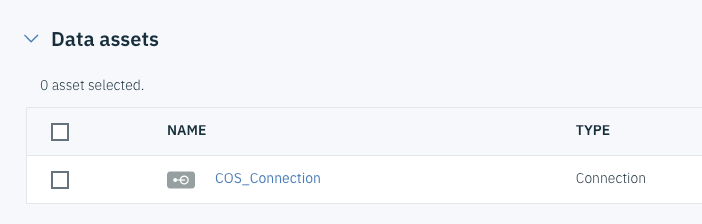

10. Now you're ready to add connected assets to your project. Click on **Add to Project**, **Connected Data**.
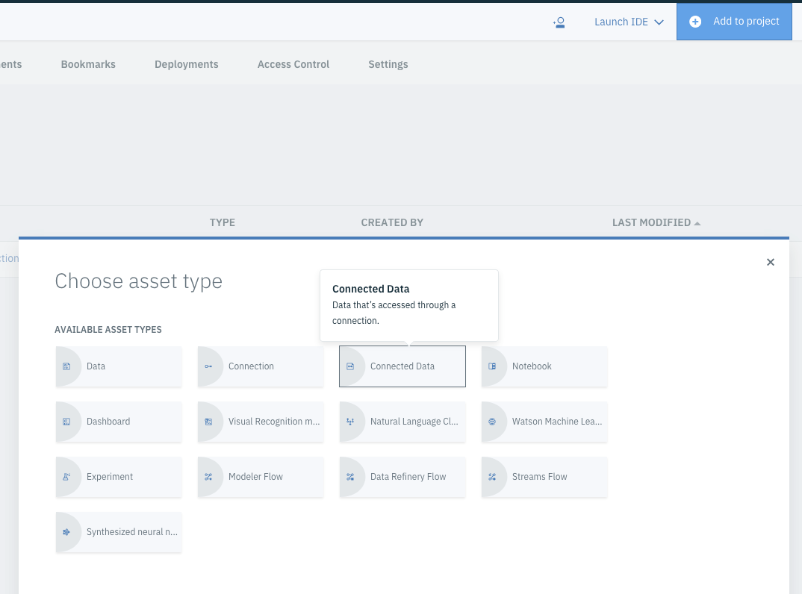

11. Select the source you have just created and navigate through the folders and file to select the file **OR FOLDER** you want to add. Let's add a folder and give it a meaningful name.

12. Upon completion, you should see a `Folder Asset` among the **Data Assets**.
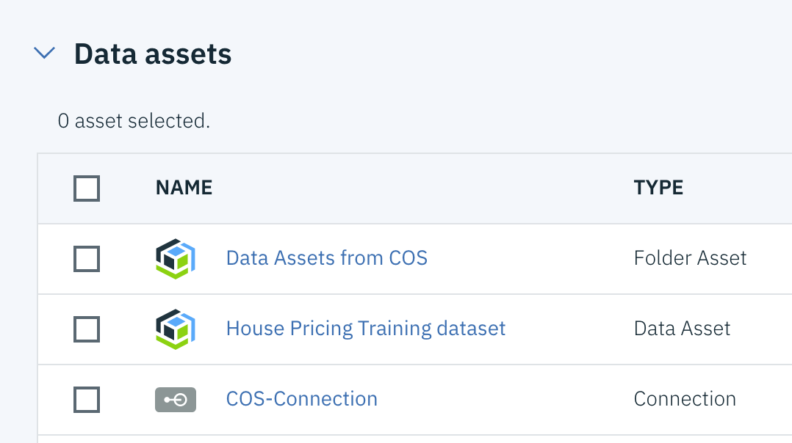

You have just added a file from a Cloud Object Storage.
