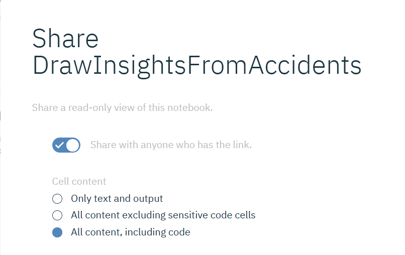
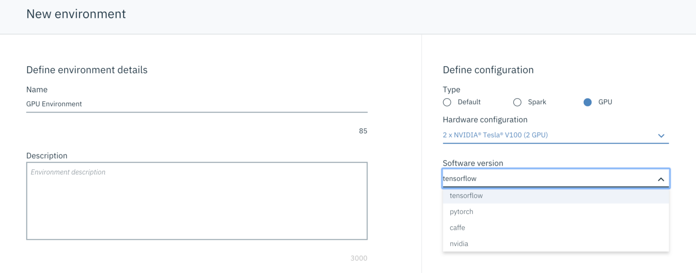

# Watson Studio Custom Workshop
**Duration:** 4 hours

## Présentation
[Watson Studio Architecture Design and Innovation](6974%20-%20Watson%20Studio%20Architecture%20Design%20and%20Innovation.pdf)

## Agenda
+ Présentation
+ Labs
+ Discussions

---

## Labs
Les labs présents dans ce workshop sont issus du workshop de prise en main de Watson Studio dont l'objectif est de dresser un tour non exhaustif des fonctionnalités de la plateforme en une journée.

1. **Lab 1 - Getting Started:** in this first Lab, we will start getting to grips with IBM Watson Studio projects, services, data assets, and run our first Jupyter Notebook.
[Lab Instructions here](Lab1-GettingStarted/Lab1-GettingStarted.md)
2. **Lab 2 - Visualization:** in this lab we will cover several data visualization capabilities provided by **IBM Watson Studio** including Brunel and PixieDust
[Lab Instructions here](Lab2-Visualizations/Lab2-Visualization.md)
3. **Lab 3 - Using Spark:** this lab will take you to create a customized Spark environment to run a Notebook.
[Lab Instructions here](Lab3-Spark/Lab3-Spark.md)
4. **Lab 4 - Time Series analysis:** Forecasting bandwidth utilization with the Time Series Node in Flow Modeler
[Lab Instructions here](Lab4-TimeSeries/Lab4_TimeSeries.md)
5. **Lab 5 - Build a Model using Model Builder:** in this lab you'll use the model builder to produce a predicive model.
[Lab Instructions here](Lab5-WatsonML/Lab5-WatsonML_Churn.md)
6. **Lab 6 - Continuous Learning:** provide feedback to a trained model and trigger automatic retraining
[Lab Instructions here](Lab7-WMLContinuousLearning/Lab7-WMLContinuousLearning.md)

---

## Questions  

_Questions issues du mail de Laurent_
### La mise sous contrôle des jeux de données et des modèles
+ gestion des droits d’accès
    + Rajout de collaborateurs et droits au niveau du projet
    + Gestion des droits d'accès au niveau des données (Knowledge Catalog). **Différents scénarios de Data Protection**
      + Accès Public / Private sans avoir à mettre de restriction avec les **Policies** [Restricting access to assets](https://dataplatform.cloud.ibm.com/docs/content/wsj/governance/dmg35.html?audience=wdp&context=analytics)
      + Restriction à l'aide de **Policies**
      [Restricting access with policies](https://dataplatform.cloud.ibm.com/docs/content/wsj/governance/dmg36.html?audience=wdp&context=analytics)
      + Authorisation de certains utilisateurs à l'aide de **Policies** [Authorizing some users only](https://dataplatform.cloud.ibm.com/docs/content/wsj/governance/dmg42.html?audience=wdp&context=analytics)
+ création / accès à des sources de données – jeux de données
    + Depuis Watson Knowledge Catalog
    + Depuis Cloud Object Storage [GettingData.md](GettingData.md)
    + Depuis des sources externes
+ catalogue
    + Watson Knowledge Catalog - **demo / discussion**  
+ versioning
    + Git/gist et **File > Save Version**
+ traçabilité des modifications
    + Integration avec Git au niveau projet

### Les capacités de collaboration à plusieurs sur un même projet
+ accès concurrents
    + Sur les data assets
    + Sur les Notebook (lock)
+ partage d’infos et de résultats
    + Publication dans le Knowledge Catalog
    + Communication via Dashboarding partageable (Web link)
    + Share notebooks (penser à sauver une version **File > Save Version** et à masquer le code sensible - credentials *@hidden_cell*)
+ visibilité des infos suivant un profil

### Mode « coders » plutôt que mode « clickers »
+ Notebooks (avec GPU)
    + **Open beta** depuis Novembre 2018, **Closed beta** aujourd'hui. Join the **[waitlist](https://datasciencex.typeform.com/to/oQg9G7)**
    + [Article Medium](https://medium.com/ibm-watson/gpu-powered-notebook-is-coming-to-watson-studio-56876f60c056)
    + GPU-powered Notebook comes with environments where popular deep learning frameworks are pre-installed. All you need to do is to pick a type of GPU, select the framework and the notebook will be ready for you.
    
+ Notebook: acceder aux fichiers du Projet (dans le COS)
    + Il n'y a pas dans la UI des Notebooks R l'equivalent pour loader directement

+ flexibilité de personnalisation des environnements
    + Possibilité de créer/personnaliser les environnements pour:
      1. Notebooks
      2. Model builder
      3. Flow editor
    + How to & Limitations [ici](https://dataplatform.cloud.ibm.com/docs/content/wsj/analyze-data/create-customize-env-definition.html?audience=wdp&context=analytics)

+ entrainements longs/interactivité de l’entrainement
+ versioning et partage du code
    + Publication dans Git

### Gestion du cycle de vie complet des modèles
+ tests répétés
+ déploiement sous forme de service
  + Déployé sur **IBM Watson Machine Learning**
    + pour *Batch, Streaming et Web Service* scoring
    + Skeleton de code d'intégration (cURL, JavaScript, Java, Scala, Python)
    + Framework supportés sur **IBM Watson Machine Learning** [ici](https://dataplatform.cloud.ibm.com/docs/content/wsj/analyze-data/pm_service_supported_frameworks.html?audience=wdp&context=analytics)
    + Deploiement de R via PMML *fournir un exemple*
+ monitoring / perf des modèles déployés
  + Dans l'interface de déploiement. Monitoring des metrics de performance, definition de seuil
  + Nécessite une base **DB2 Warehouse on Cloud** ou **PostGreSQL on Cloud**
  + How to [ici](https://dataplatform.cloud.ibm.com/docs/content/wsj/analyze-data/ml-continuous-learning.html?audience=wdp&context=analytics)

### Intégration avec les services Watson
+ NLP / images
  + Watson Studio est l'outil d'entrainement pour **Watson Natural Language Classifier** et pour **Watson Visual Recognition**.
+ AI Open Scale
  + *A compléter*

### Intégration avec la stack Hortonworks

---
### Resources
+ **Webinar - IBM Watson Machine Learning and Watson OpenScale: Automate and Operationalize AI** Registration [here](https://event.on24.com/eventRegistration/EventLobbyServlet?target=reg20.jsp&partnerref=newsletter&eventid=1916519&sessionid=1&key=2A14FE34B6ACA058F5A9B0D112D1FEA0&regTag=&sourcepage=register)
